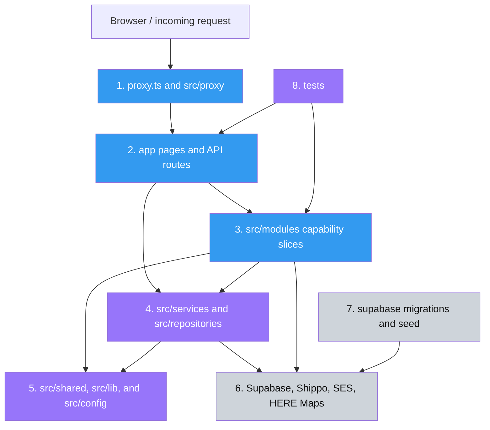

# Realdealkickzsc Webstore Developer Onboarding

This guide takes a new developer from a clean workstation to a fully running local copy of
the Real Deal Kickz (RDK) webstore. The normal development setup uses a Doppler service token
to inject configuration into the application process. You do **not** need to create
`.env.local`, copy secrets, or run Supabase locally for the initial setup.

> **Primary setup target:** Windows PowerShell, Node.js 20, hosted development services via
> Doppler, and Next.js at <http://localhost:3000>.

## Table of contents

- [What you are setting up](#what-you-are-setting-up)
- [Access to request before starting](#access-to-request-before-starting)
- [Required tools](#required-tools)
- [Clone and install](#clone-and-install)
- [Configure Doppler without local env files](#configure-doppler-without-local-env-files)
- [Start the application](#start-the-application)
- [Verify the setup](#verify-the-setup)
- [Daily development workflow](#daily-development-workflow)
- [Useful npm commands](#useful-npm-commands)
- [Optional tools and workflows](#optional-tools-and-workflows)
- [Architecture and codebase tour](#architecture-and-codebase-tour)
- [Engineering conventions](#engineering-conventions)
- [Important areas to treat carefully](#important-areas-to-treat-carefully)
- [Domain glossary](#domain-glossary)
- [Troubleshooting](#troubleshooting)
- [First contributions](#first-contributions)
- [First-day completion checklist](#first-day-completion-checklist)

## What you are setting up

RDK is a full-stack ecommerce application with two main user experiences:

- A customer storefront for browsing products, managing a cart, checking out, viewing order
  status, and managing an account.
- An admin console for catalog and inventory management, customer support, order processing,
  shipping, tax nexus tracking, and store settings.

The application is a Next.js 16 modular monolith using React 19 and TypeScript. It uses
Supabase for Postgres, authentication, and storage; Shippo for shipping; AWS SES for email;
HERE Maps for address support; and a hosted payment flow for checkout.

During the normal onboarding flow:

1. Next.js runs on your workstation.
2. Doppler injects the development configuration into the Next.js process.
3. The app connects to the hosted development dependencies selected by that token.
4. No secrets are written into the repository.

## Access to request before starting

Ask the team for all of the following:

- GitHub access to `rushinski/rdk-webstore`.
- A **development-only Doppler service token** beginning with `dp.st.`.
- The branch you should work from. The repository default is `main`; the team may direct active
  feature work to another branch.
- A development customer account if your task involves authenticated storefront behavior.
- A development admin account with MFA if your task involves `/admin`.
- Supabase, Shippo, AWS, Vercel, or other vendor dashboard access only if your assigned work
  requires it. These accounts are not required simply to start the application.

Treat the Doppler token like a password. Do not paste it into chat, tickets, screenshots, shell
history files, source code, or committed documentation. If it is exposed, stop using it and ask
the token owner to revoke and replace it.

## Required tools

| Tool        | Project expectation                      | Why it is needed                                    | Verify              |
| ----------- | ---------------------------------------- | --------------------------------------------------- | ------------------- |
| Git         | Current supported release                | Clone the repository and create branches            | `git --version`     |
| Node.js     | **20.x** to match GitHub Actions         | Run Next.js, TypeScript, tests, and project scripts | `node --version`    |
| npm         | Bundled with Node.js                     | Install the locked dependency tree and run scripts  | `npm --version`     |
| Doppler CLI | Current supported release                | Inject development secrets at process runtime       | `doppler --version` |
| Web browser | Current Chrome, Edge, Firefox, or Safari | Exercise the local storefront and admin UI          | Open the local URL  |

The CI workflows currently pin Node.js 20. Use Node 20 for reproducible behavior even if a newer
Node release is installed elsewhere on your workstation. This repository does not currently
contain `.nvmrc`, `.node-version`, or an `engines` declaration, so your version manager will not
switch versions automatically.

### Windows installation

Open PowerShell. Install Git and Doppler with `winget` if they are not already available:

```powershell
winget install --id Git.Git --exact
winget install --id Doppler.Doppler --exact
```

Install a Node.js 20.x release from the [official Node.js downloads](https://nodejs.org/en/download)
or select Node 20 with your organization-approved Node version manager. Close and reopen
PowerShell after installing tools so the updated `PATH` is loaded.

Verify the toolchain:

```powershell
git --version
node --version
npm --version
doppler --version
```

The Node output should begin with `v20.`. Doppler officially supports regular PowerShell and
Command Prompt sessions; PowerShell is used throughout this guide.

### macOS installation

Install Git, a Node version manager or Node 20, and Doppler. Doppler's supported Homebrew install
is:

```bash
brew install gnupg
brew install dopplerhq/cli/doppler
```

Select Node 20 using your version manager, then verify:

```bash
git --version
node --version
npm --version
doppler --version
```

### Linux installation

Install Git and Node 20 using your distribution or organization-approved version manager. Install
the Doppler CLI using the instructions for your distribution in the
[official Doppler installation guide](https://docs.doppler.com/docs/install-cli), then run:

```bash
git --version
node --version
npm --version
doppler --version
```

## Clone and install

### 1. Clone the repository

Use HTTPS:

```powershell
git clone https://github.com/rushinski/rdk-webstore.git
Set-Location rdk-webstore
```

If your team uses SSH and your key is already configured, use the SSH remote instead:

```powershell
git clone git@github.com:rushinski/rdk-webstore.git
Set-Location rdk-webstore
```

Confirm that the remote and branch are what you expect:

```powershell
git remote -v
git branch --show-current
git status
```

A normal clean clone starts on `main` and reports a clean working tree. If the team directed you
to another integration branch, switch to it before creating your feature branch:

```powershell
git fetch --all --prune
git switch <team-branch>
git pull --ff-only
```

### 2. Install the exact dependency tree

```powershell
npm ci
```

Use `npm ci` for onboarding and routine clean installs. It installs exactly what is recorded in
`package-lock.json` and removes an existing `node_modules` directory before installing. Do not use
`npm install` merely to set up the repository because it can update the lockfile.

Expected result:

- `node_modules/` is created.
- The command exits successfully.
- `git status --short` does not show changes to `package.json` or `package-lock.json`.

Check that the installation did not alter tracked files:

```powershell
git status --short
```

Next.js may regenerate `next-env.d.ts` when it runs. Review rather than blindly discarding any
change; unrelated working-tree changes may belong to ongoing work.

## Configure Doppler without local env files

There is intentionally no `doppler.yaml` in the repository and a new developer is not expected
to run `doppler login` or `doppler setup`. The service token identifies the Doppler project and
configuration and authorizes the child process.

### PowerShell

Set the token only in the current PowerShell session:

```powershell
$env:DOPPLER_TOKEN = "dp.st.dev-token..."
```

Confirm only that a value is present. Do not print the token itself:

```powershell
if ($env:DOPPLER_TOKEN) { "Doppler token is set for this session" }
```

Validate that Doppler can inject the variables required by the application:

```powershell
doppler run -- npm run env:check
```

The command should exit without a Zod validation error. It runs `src/config/env.ts`, which is the
runtime source of truth for required server-side environment variables.

### macOS or Linux shell

```bash
export DOPPLER_TOKEN="dp.st.dev-token..."
doppler run -- npm run env:check
```

### Secret-handling rules

- Do **not** create `.env.local` for the normal development workflow.
- Do **not** copy Doppler values into `.env.example`; that file contains names and placeholders
  only.
- Do **not** use `setx DOPPLER_TOKEN ...` on Windows or add the token to a shell profile. Those
  approaches persist it beyond the current terminal session.
- Do **not** prefix ordinary commands with Doppler unless they need application configuration.
- Use a development token only. Never run the local app with staging or production credentials.
- Close the terminal or explicitly clear the token when you finish:

```powershell
Remove-Item Env:DOPPLER_TOKEN
```

On macOS or Linux, use `unset DOPPLER_TOKEN`.

## Start the application

From the repository root, in the same PowerShell session where the token was set, run:

```powershell
$env:DOPPLER_TOKEN = "dp.st.dev-token..."
doppler run -- npm run dev
```

The second command starts the Next.js development server and keeps that terminal occupied. Keep
it open while developing. To stop the server, press `Ctrl+C`.

Expected startup behavior:

- Next.js compiles the application.
- The terminal reports a local URL, normally <http://localhost:3000>.
- Opening the URL renders the storefront.
- Environment validation succeeds because the Next.js process received its variables from
  Doppler.

If port 3000 is already in use, Next.js may select another port. Use the URL printed in the
terminal. If the project's configured site URL or authentication callbacks require port 3000,
stop the conflicting process and restart on port 3000 instead of continuing on an alternate port.

## Verify the setup

Run these checks after the first successful startup.

### 1. Browser smoke test

Open the following pages:

| URL                                 | What to check                                                          |
| ----------------------------------- | ---------------------------------------------------------------------- |
| <http://localhost:3000/>            | Homepage loads without a full-page error                               |
| <http://localhost:3000/store>       | Product catalog loads from the development data source                 |
| <http://localhost:3000/auth/login>  | Authentication screen renders                                          |
| <http://localhost:3000/api/healthz> | Returns `{"status":"ok"}`                                              |
| <http://localhost:3000/api/readyz>  | Reports database readiness; a healthy response includes `"ready":true` |

The liveness endpoint only proves the Next.js process is serving requests. The readiness endpoint
also performs a Supabase query and is the better end-to-end configuration check.

### 2. Repository checks

Open a second terminal in the repository root. These checks do not need production secrets because
the test setup supplies safe test values:

```powershell
npm run check:file-case
npm run check:env-case
npm run lint
npm run typecheck
npm run test:unit
```

Current baseline note: `check:file-case` exits successfully but prints a large existing
`Invalid casing detected` inventory because its naming policy does not match many established
camelCase support files. Treat newly introduced entries as review signals, but do not interpret
the existing list as a failed installation. `lint` is the enforced naming/formatting check and can
take roughly two minutes on this repository.

For a release-like local build, use Doppler because Next.js evaluates the runtime configuration
during its build:

```powershell
$env:DOPPLER_TOKEN = "dp.st.dev-token..."
doppler run -- npm run build
```

Do not run the production server (`npm start`) until `npm run build` has completed. When needed:

```powershell
doppler run -- npm start
```

## Daily development workflow

### Start of day

```powershell
Set-Location <path-to-your-clone>\rdk-webstore
git switch main
git pull --ff-only
git switch -c <your-name>/<short-description>
$env:DOPPLER_TOKEN = "dp.st.dev-token..."
doppler run -- npm run dev
```

Replace `main` with the team-designated base branch when applicable. If the feature branch already
exists, use `git switch <branch>` instead of creating it again.

### While developing

- Keep route files and pages thin.
- Add behavior to the owning module under `src/modules/<capability>/` when possible.
- Add or update tests with the behavior.
- Run focused Vitest tests during development, for example:

```powershell
npx vitest run tests/unit/modules/storefront/storefront-catalog-application.test.ts
```

- Use watch mode for rapid feedback:

```powershell
npm run test:unit:watch
```

### Before opening a pull request

```powershell
npm run check:file-case
npm run check:env-case
npm run lint
npm run typecheck
npm run test:unit
doppler run -- npm run build
git status --short
```

Review every changed file, including generated or formatting changes, before committing:

```powershell
git diff --check
git diff
```

### End of day

Stop the development server with `Ctrl+C`, then remove the session token:

```powershell
Remove-Item Env:DOPPLER_TOKEN
```

## Useful npm commands

| Command                    | Purpose                                                                         | Needs Doppler?                             |
| -------------------------- | ------------------------------------------------------------------------------- | ------------------------------------------ |
| `npm ci`                   | Install the locked dependency tree                                              | No                                         |
| `npm run dev`              | Start Next.js development mode                                                  | **Yes**; run through `doppler run --`      |
| `npm run env:check`        | Validate runtime environment variables                                          | **Yes**; run through Doppler               |
| `npm run check:env-case`   | Check environment-variable name casing                                          | No                                         |
| `npm run check:file-case`  | Print the filename-casing inventory (currently includes known baseline entries) | No                                         |
| `npm run lint`             | Run ESLint and Prettier enforcement                                             | No                                         |
| `npm run lint:fix`         | Apply ESLint auto-fixes                                                         | No, but inspect all edits                  |
| `npm run typecheck`        | Run TypeScript without emitting files                                           | No                                         |
| `npm test`                 | Run the default Vitest suite                                                    | No                                         |
| `npm run test:unit`        | Run unit and architecture tests once                                            | No                                         |
| `npm run test:unit:watch`  | Run Vitest interactively in watch mode                                          | No                                         |
| `npm run test:integration` | Run `tests/integration` if integration tests exist                              | Usually yes for live integrations          |
| `npm run test:e2e`         | Run Playwright tests                                                            | Depends on target and test configuration   |
| `npm run test:rls`         | Run the RLS check entrypoint                                                    | Requires a suitable database configuration |
| `npm run build`            | Create a production Next.js build                                               | **Yes**; run through Doppler               |
| `npm start`                | Serve an existing production build                                              | **Yes**; run through Doppler               |
| `npm run format`           | Rewrite files with Prettier                                                     | No; inspect the resulting diff             |
| `npm run gen:types:hosted` | Regenerate Supabase database types from the hosted project                      | Requires authorized Supabase access        |
| `npm run gen:types:local`  | Regenerate database types from a local Supabase stack                           | Requires local Supabase                    |

The `test:integration` command is prepared to pass when no integration tests exist, and no tracked
`tests/integration` directory currently exists. The `test:rls` command currently references an
untracked/missing `tests/rls/rls-check.ts` entrypoint. Confirm the team's current plan before
depending on either command as a local gate.

## Optional tools and workflows

These are not required for the Doppler-backed first run.

### VS Code

VS Code is a convenient editor for the TypeScript/React stack. Recommended extensions include:

- ESLint
- Prettier
- Tailwind CSS IntelliSense
- Playwright Test for VS Code, if you are working on browser tests

Use the repository ESLint and Prettier configurations as the source of truth. Configure format on
save only if you are comfortable reviewing its entire diff.

### Playwright browsers

`@playwright/test` is installed by `npm ci`, but its browser binaries are installed separately.
Only install them if you are working on browser tests:

```powershell
npx playwright install
```

Playwright browser versions are tied to the installed Playwright package, so rerun the install
after a Playwright upgrade. See the [official browser installation guide](https://playwright.dev/docs/browsers).

At the time this guide was written, the repository has a Playwright npm command but no tracked
`playwright.config.*` or `tests/e2e/` suite. Confirm the intended E2E target with the team before
building a workflow around `npm run test:e2e`.

### Local Supabase and Docker

The standard Doppler token points the application at hosted development services, so Docker is not
needed for ordinary UI and application work.

Use a local Supabase stack only for database migrations, RLS changes, isolated data work, or a task
that explicitly requires it. The Supabase CLI itself is invoked through `npx` by the package
scripts, but a local stack also requires a Docker-compatible container runtime.

Important repository-specific limitation: `supabase/config.toml` is ignored and is not included in
a clean clone. Therefore, `npm run supabase:start` is **not** a complete newcomer setup by itself.
Before starting a local database:

1. Ask the team for the approved local `supabase/config.toml` and local environment workflow.
2. Install and start Docker Desktop or another Docker-compatible runtime.
3. Confirm that no hosted or production database URL is being used for reset or migration commands.
4. Start the stack with `npm run supabase:start` only after the configuration is in place.
5. Inspect local service URLs and credentials printed by the CLI.
6. Point the app at those local values using the team-approved method; the normal hosted Doppler
   token will otherwise continue to select hosted services.

Supabase documents Docker-compatible runtimes and the CLI workflow in its
[local development guide](https://supabase.com/docs/guides/local-development). Never run
`supabase db reset`, migration repair, destructive SQL, or seed scripts against a shared hosted
database without explicit approval.

### Local HTTPS with Caddy

Local HTTPS is optional and may be useful for auth callbacks or secure-cookie behavior. Install
Caddy using its official platform instructions, start Next.js on port 3000, then in a second
terminal run:

```powershell
npm run caddy:start
```

The tracked `infra/Caddyfile` exposes Next.js at <https://localhost:8444>. Its local Supabase proxy
expects a separately configured local Supabase service, so it is not needed when the app uses the
hosted development Supabase project. Your browser may require trusting Caddy's local certificate.

Stop Caddy with:

```powershell
npm run caddy:stop
```

## Architecture and codebase tour

### Runtime and recommended reading order

Arrows mean “calls or depends on.” The colors indicate reading order, not code quality.



Suggested reading path:

1. Start with `app/page.tsx`, `app/store/page.tsx`, and one small API route to see how Next.js
   entrypoints compose the application.
2. Read `proxy.ts` and `docs/PROXY_PIPELINE.md` to understand session refresh, CSRF enforcement,
   admin gating, security headers, and request IDs.
3. Follow a feature into `src/modules/storefront`, `src/modules/catalog`, or
   `src/modules/orders`.
4. Read `docs/ARCHITECTURE_RULES.md` before deciding where new code belongs.
5. Read shared configuration and Supabase client factories only after understanding the feature
   flow.

### Top-level repository guide

#### Things users and requests interact with

- **`app/`** — Next.js App Router pages, layouts, error boundaries, and API route handlers. Pages
  should compose module presentation code; API routes should validate, authorize, orchestrate, and
  format responses rather than own business rules.
- **`public/`** — Static images, icons, brand assets, the favicon, and `robots.txt`. Files are served
  from the web root and should be treated as public.
- **`proxy.ts` and `src/proxy/`** — The request gateway. It canonicalizes URLs, refreshes Supabase
  sessions, enforces CSRF rules, protects admin routes, adds request IDs, and applies security
  headers.

#### Business logic and presentation

- **`src/modules/`** — The target home for feature-owned code in this modular monolith. Mature
  slices may contain `domain`, `application`, `infrastructure`, and `presentation` layers.
- **`src/components/`** — Legacy/shared React component areas, including checkout and UI pieces.
  Prefer the owning module or `src/shared/ui` for new code when the architecture rules allow it.
- **`src/services/`** — Existing business services and integration orchestration. This is a legacy
  global layer being incrementally moved into capability modules.
- **`src/repositories/`** — Existing Supabase data-access functions. Repository code owns database
  queries and should not leak directly into UI code.
- **`src/shared/`** — Cross-module capabilities, currently including shared cart support and
  generic UI. Code here must remain domain-neutral.
- **`src/contexts/`** — Cross-cutting React context that has not yet moved into a capability-owned
  shared boundary.

#### Infrastructure and supporting code

- **`src/lib/`** — Shared auth, Supabase, email, validation, logging, HTTP, crypto, and other
  infrastructure helpers.
- **`src/config/`** — Environment validation, security configuration, brand configuration, and
  centralized constants.
- **`src/types/`** — Shared application types and generated database types.
- **`src/styles/`** — Global styling support. Tailwind and PostCSS configuration live at the
  repository root.
- **`supabase/`** — Ordered SQL migrations, seed data, email templates, and developer SQL snippets.
  Migration history is part of the application contract.
- **`infra/`** — Local infrastructure configuration, currently Caddy.
- **`scripts/`** — Repository maintenance and data-inspection scripts.
- **`tests/`** — Vitest unit and architecture tests plus shared test setup. Tests are currently
  concentrated in `tests/unit` and `tests/architecture`.
- **`docs/`** — Architecture, API, security, infrastructure, deployment, monitoring, proxy, and
  runbook documentation. Historical plans and specifications live under `docs/superpowers` and
  may describe completed or superseded work.

### Capability modules

| Module       | Responsibility                                                                                          | Current layer shape                                             |
| ------------ | ------------------------------------------------------------------------------------------------------- | --------------------------------------------------------------- |
| `account`    | Customer account profile and address presentation                                                       | Presentation                                                    |
| `app-shell`  | Root/admin layouts and system error/not-found experiences                                               | Presentation                                                    |
| `auth`       | Login, registration, OTP, password recovery, and MFA UI                                                 | Presentation                                                    |
| `catalog`    | Catalog normalization, products, inventory-facing catalog tools, featured products                      | Application, infrastructure, presentation                       |
| `checkout`   | Cart and checkout screen composition                                                                    | Presentation; server workflows still use shared services/routes |
| `customers`  | Admin customer list and detail experiences                                                              | Presentation                                                    |
| `dashboard`  | Admin dashboard experiences and data display                                                            | Presentation                                                    |
| `marketing`  | Marketing-facing presentation such as brand and content surfaces                                        | Presentation                                                    |
| `nexus`      | Sales-tax nexus tracking UI                                                                             | Presentation                                                    |
| `orders`     | Orders, access tokens, repositories, status helpers, refunds, shipping, pickups, and transaction detail | Domain scaffold, application, infrastructure, presentation      |
| `settings`   | Store-access, tax, shipping, and related admin settings                                                 | Presentation and shared settings support                        |
| `shared`     | Shared admin presentation primitives and shell support                                                  | Presentation                                                    |
| `storefront` | Homepage, product browse, brands, product detail, search, and storefront shell                          | Application, infrastructure, presentation                       |
| `support`    | Customer-support-facing presentation such as contact flows                                              | Presentation                                                    |

The codebase is midway through a global-layer-to-module migration. Do not assume every feature has
all four layers yet, and do not create empty layers merely for symmetry.

### Request flow

For a typical API request:

1. `proxy.ts` canonicalizes the path, refreshes the session, adds a request ID, checks CSRF for
   unsafe methods, and applies admin protection where necessary.
2. An `app/api/**/route.ts` handler parses the request, validates input with Zod, authenticates the
   caller, and creates the appropriate Supabase client.
3. A module application service or legacy `src/services` function coordinates the use case.
4. A module infrastructure repository or legacy `src/repositories` function queries Supabase.
5. External adapters call services such as Shippo, HERE Maps, or AWS SES where required.
6. The route returns a response; the proxy finalizer applies request/security headers.

For a typical page request, a thin `app/**/page.tsx` composes an exported module presentation
component. Interactive components use client boundaries only where browser state or effects are
needed.

## Engineering conventions

### Architecture

- Organize new work by business capability under `src/modules/<module>`.
- Keep `app/**` as framework adapters and composition roots.
- Keep domain code free of React, Next.js, Supabase, and vendor SDK imports.
- Put orchestration and use cases in `application`.
- Put database and vendor implementations in `infrastructure`.
- Put screens, hooks, view models, and feature-owned components in `presentation`.
- Access another module through its public `index.ts` exports, not its private infrastructure.
- Keep generic shared code in `src/shared`; domain-specific helpers belong to their module.
- Do not create a Supabase client inside a service. Routes/jobs create clients and pass them in.
- Database queries belong in repository/infrastructure code, not React components or domain code.

### TypeScript and imports

- TypeScript strict mode is enabled.
- Use the `@/` alias for files under `src`, for example `@/config/env`.
- Use `import type` where an import is only a type.
- Separate import groups with blank lines; ESLint enforces ordering.
- Classes, types, interfaces, and React components use `PascalCase`.
- Functions and ordinary variables use `camelCase`.
- Constants and enum members use `UPPER_CASE`.
- Prefix intentionally unused parameters or caught errors with `_`.
- Avoid `any`; ESLint warns on explicit `any`.

### Files and formatting

- Use two spaces, semicolons, double quotes, trailing commas, and LF line endings.
- Prettier uses a 90-character print width.
- React component filenames are generally `PascalCase.tsx`.
- Helpers, services, repositories, and request/state modules generally use `kebab-case.ts` or the
  established feature-local pattern.
- API handlers are named `route.ts`; App Router pages are `page.tsx`; layouts are `layout.tsx`.
- Tests use `.test.ts` or `.test.tsx` under `tests/unit` or `tests/architecture`.

### Validation and errors

- Use Zod schemas under `src/lib/validation` or the owning module for untrusted input.
- Reject invalid input at the route boundary.
- Return deliberate HTTP status codes and safe client-facing error messages.
- Do not expose provider responses, database details, credentials, or stack traces to clients.
- Use structured logging helpers and preserve request IDs when diagnosing request flows.
- Error boundaries are placed at important App Router segments such as account, admin, cart,
  checkout, and store.

### Testing

- Vitest with jsdom is the active unit and architecture runner.
- Testing Library is used for React behavior.
- `tests/setup/vitest.setup.ts` supplies safe test environment values and transitional Jest
  compatibility.
- Architecture tests intentionally guard route shape, import boundaries, and migration structure.
- Prefer behavior tests for business logic and focused structure tests for architectural contracts.
- Run the smallest relevant test during implementation and the full unit suite before a PR.

## Important areas to treat carefully

- **Hosted development data:** A Doppler-backed app may operate on a shared development database.
  Avoid bulk edits, destructive admin actions, and seed/reset commands unless you understand the
  target and have team approval.
- **Checkout and order completion:** Server-calculated totals, idempotency, payment lifecycle,
  inventory changes, and completion emails must stay coordinated. Run the relevant checkout and
  order tests and perform a full development checkout when changing these flows.
- **Authentication and admin access:** `proxy.ts`, `src/proxy`, Supabase session helpers, CSRF
  enforcement, admin roles, and MFA collectively protect privileged routes. A local UI check alone
  is not sufficient verification for changes here.
- **Supabase migrations and RLS:** Migration ordering and row-level security affect every
  environment. Add forward migrations; do not rewrite migration history that has already been
  applied. Test database and authorization changes in an isolated approved environment.
- **Service-role access:** `SUPABASE_SECRET_KEY` bypasses normal client restrictions. It must remain
  server-only and must never be imported into a client component or exposed through
  `NEXT_PUBLIC_*` variables.
- **Email and shipping:** Development actions can call AWS SES or Shippo depending on the injected
  configuration. Confirm sandbox/test behavior before purchasing labels or sending messages.
- **Module migration:** Some capabilities use `src/modules`, while others still depend on global
  `src/services`, `src/repositories`, and `src/components`. Follow existing public exports and make
  incremental moves; avoid an unrelated repo-wide relocation in a feature PR.
- **Generated database types:** `src/types/db/database.types.ts` represents the database contract.
  Regenerate it only against the intended schema and review the resulting diff.
- **Historical documentation:** Files in `docs/superpowers` are valuable design history but may not
  describe current runtime behavior. Prefer current code, tests, and primary docs at `docs/*.md`.

## Domain glossary

| Term                     | Meaning in this codebase                                                                                    |
| ------------------------ | ----------------------------------------------------------------------------------------------------------- |
| Product                  | A sellable catalog family with descriptive data, lifecycle state, images, and variants                      |
| Product variant          | A specific SKU-level option of a product, such as a size, with inventory and pricing data                   |
| Catalog brand/model      | Normalized brand and model metadata used to organize and filter inventory                                   |
| Catalog candidate        | A proposed normalized catalog value awaiting an admin accept/reject decision                                |
| Featured item            | A product selected and ordered for prominent storefront placement                                           |
| Cart snapshot            | A server-verifiable representation of cart state used to restore or validate a checkout                     |
| Checkout                 | The server-validated flow that prices items, collects fulfillment details, and initiates hosted payment     |
| Order                    | The persisted commercial record and source of truth for payment and fulfillment state                       |
| Payment event            | A recorded transition or provider event associated with an order payment lifecycle                          |
| Fulfillment              | The process of preparing an order for shipment or pickup and updating its status                            |
| Shipping label           | A carrier label purchased through Shippo and associated with an order shipment                              |
| Pickup order             | An order fulfilled at the store rather than delivered by a carrier                                          |
| Profile                  | The application record associated with an authenticated Supabase user                                       |
| Guest order access token | An expiring token that permits limited order-status access without an account; only its HMAC hash is stored |
| Admin role               | A privileged role (`admin`, `super_admin`, or `dev`) used with session and MFA checks                       |
| Nexus                    | State-level sales activity tracked against thresholds for sales-tax obligations                             |
| Store access settings    | Administrative controls that can lock or limit storefront/checkout access                                   |
| Tenant                   | The ownership boundary represented in the schema; the current release operates as a single tenant           |

## Troubleshooting

### `doppler` is not recognized

Close and reopen the terminal after installing Doppler, then run:

```powershell
doppler --version
```

If it still fails, confirm the Doppler install directory is on `PATH` or reinstall with the
[official Doppler instructions](https://docs.doppler.com/docs/install-cli).

### Doppler reports an invalid or unauthorized token

- Confirm there are no leading/trailing spaces in the value.
- Confirm the value begins with `dp.st.` and was assigned in the current terminal.
- Do not try to inspect or print the full token.
- Ask the issuer whether the token was revoked, expired, or scoped to the wrong configuration.

Reset the current value before retrying:

```powershell
Remove-Item Env:DOPPLER_TOKEN -ErrorAction SilentlyContinue
$env:DOPPLER_TOKEN = "dp.st.dev-token..."
doppler run -- npm run env:check
```

### Environment validation fails

The startup schema requires site, Supabase, Shippo, HERE Maps, Google, SES/AWS, support email, and
order-token settings. A missing/invalid-value Zod error normally means the supplied Doppler token
selects an incomplete or incorrect configuration. Do not create a local env file to work around
it; send the variable **name only**, never its value, to the token/configuration owner.

### `npm ci` fails

```powershell
node --version
npm --version
git status --short
```

Confirm Node 20 is active, the lockfile is present, and no proxy/registry policy is blocking npm.
Do not delete or rewrite `package-lock.json` to solve an installation problem. If a previous
install was interrupted, rerunning `npm ci` is safe; it recreates `node_modules`.

### The app cannot use port 3000

Find the listener in PowerShell:

```powershell
Get-NetTCPConnection -LocalPort 3000 -State Listen
```

Stop the process only if it belongs to you and is safe to terminate. Then restart the app. If you
continue on another port, auth callbacks and `NEXT_PUBLIC_SITE_URL` may not match.

### Homepage works but `/api/readyz` fails

The Next.js process is alive, but the app cannot successfully query Supabase. Check the server
terminal for the request error, rerun `doppler run -- npm run env:check`, confirm the token is for
development, and ask the team whether the hosted development Supabase project is healthy.

### Login redirects to the wrong URL

Confirm you are using the expected local port and protocol. Auth redirects depend on both the
injected `NEXT_PUBLIC_SITE_URL` and Supabase's configured redirect allow-list. Do not change shared
auth configuration without coordinating with the team.

### Images do not load

Check the browser network panel and verify that the product image URL is from an allowed Supabase
Storage or configured CDN hostname. The Next.js image configuration is in `next.config.ts`.

### Tests pass but the development server fails

The Vitest setup provides fake test environment values, while the development server validates
the actual injected configuration. Treat `doppler run -- npm run env:check` and `/api/readyz` as
separate required checks.

### PowerShell blocks a script

If npm's PowerShell shim is restricted by organization policy, do not lower machine-wide security
settings without approval. Use a permitted shell or ask IT for the approved PowerShell execution
policy.

## First contributions

Good first tasks have narrow boundaries, clear tests, and no direct production integration impact:

1. **Storefront presentation refinement:** Start in `src/modules/storefront/presentation` and add or
   adjust a focused component with a Testing Library test. Avoid checkout pricing or mutation
   behavior in the first change.
2. **Generic UI improvement:** Work in `src/shared/ui` or an established module-owned presentation
   primitive, preserving its public API and adding an interaction/accessibility test.
3. **Documentation or architecture-test improvement:** Correct a current primary document or add a
   narrow architecture guard in `tests/architecture` for an already documented rule.

Before choosing a first task, read the nearest tests and public `index.ts` file. Ask the module
owner to confirm the intended boundary if the change would touch both `src/modules` and a legacy
global service/repository.

## First-day completion checklist

- [ ] GitHub repository access works.
- [ ] Git, Node 20, npm, and Doppler are installed and available in a new terminal.
- [ ] The repository is cloned from the expected remote.
- [ ] `npm ci` succeeds without changing `package.json` or `package-lock.json`.
- [ ] A development-only Doppler service token has been supplied securely.
- [ ] No `.env.local` or other secret file was created.
- [ ] `doppler run -- npm run env:check` succeeds.
- [ ] `doppler run -- npm run dev` starts Next.js.
- [ ] Homepage and `/store` load locally.
- [ ] `/api/healthz` returns healthy.
- [ ] `/api/readyz` confirms Supabase readiness.
- [ ] `npm run lint`, `npm run typecheck`, and `npm run test:unit` complete successfully.
- [ ] The developer can sign in with the appropriate development account.
- [ ] The developer has read `docs/ARCHITECTURE_RULES.md` and `docs/SECURITY.md` before changing
      server or auth code.
- [ ] The developer understands that the default Doppler setup may use shared development data.
- [ ] The Doppler token is removed from the shell when the session ends.